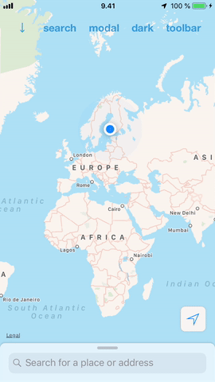
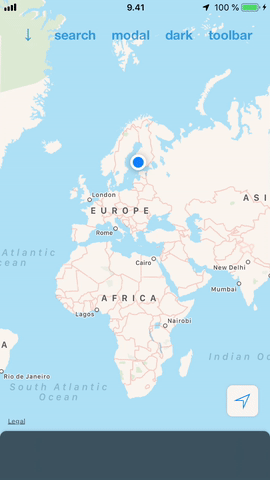
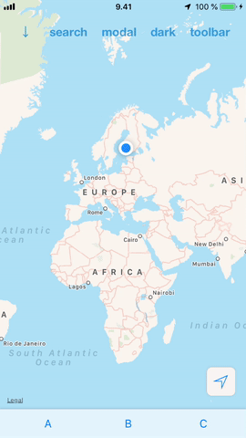

# DrawerView

DrawerView is a view for iOS that mimics the functionality of the drawer introduced in the Maps (iOS 10 →).





#### Ease of use

DrawerView is a simple drop-in view that you can add to your app. No need to restructure your views or view controllers to add support for it. This also makes it possible to have multiple drawers hosting different content and switch between them the same way it is done in the iOS Maps.

#### Automatic support for scroll views

DrawerView handles subview interaction so that it adds specialized support for scroll views. What this practically means is that you can add a scroll view (or a table view) inside it and the DrawerView will handle the transition from scrolling the subview to scrolling the drawer.

#### Customization

**Visuals**: By default DrawerView supports `UIBlurEffect` as a background. However, any `UIColor` is supported too. Just remember to set `backgroundEffect` to nil. Besides background, corner radius, borders and shadow can be customized as well.

**Position**: The drawer has four distinct positions: `closed`, `collapsed`, `partiallyOpen`, `open`. Each of these positions can be customized and you can define the enabled positions.

**Bottom Inset**: To support iOS devices with a notch at the bottom of the screen, you can change `insetAdjustmentBehavior` to automatically determine the correct inset. You can also set it to use the safe area of the superview or set it to a fixed value. Due to the content being overlapping with the notch you can change `contentVisibilityBehavior` to define which views should be hidden when collapsed. By default these two properties are set to automatic.

**Visibility**: You can also set the visibility of the drawer. This is a distinct property from position, but acts the same way as if the drawer was closed. The purpose of this is to help you so that you don't have to remember the previous position if the drawer is made visible again. This in turn makes it convenient to have multiple drawers but only one visible at a time.


## Installation

You can install DrawerView with Carthage and CocoaPods. With CocoaPods, add the following into your `Podfile`:

```ruby
pod "DrawerView"
```

For Carthage add the following into your `Cartfile`:

```
github "mkko/DrawerView"
```

## Usage

DrawerView tries automatically to occupy the view it will be added to. It uses autolayout to set its position, and thus you can attach views to it You can set it up with storyboards or programmatically

### Setting things up

Here's listed the possible ways of setting things up. Hands-on examples of setting things up can be found from the included [example project](./Example).


#### Set up in storyboards

Storyboard is supported in two ways: as an embedded view and as a child view controller.

##### As child view controller

You can add contents of one view controller as a drawer to another view controller, almost the same way as you would use "Container View".

1. Create the two view controllers.
2. Define a storyboard ID for the drawer view controller (eg. "DrawerViewController")
3. Make the connection in code:

```swift
override func viewDidLoad() {
    super.viewDidLoad()

    let drawerViewController = self.storyboard!.instantiateViewController(withIdentifier: "DrawerViewController")
    self.addDrawerView(withViewController: drawerViewController)
}
```

##### As embedded view

1. Create a view in storyboard that is not inside the view controller view hierarchy. To do this, you can for instance drag a new view directly to the document outline.
2. Set a custom class of the view to a `DrawerView`.
4. Connect the `containerView` IBOutlet of the newly created view to the view where you want it to be added (e.g. the view controller root view).


#### Set up programmatically

Programmatic setup is pretty much the same as setting up any `UIView`: you create one, set it up with subviews and add it to a view. Here's an example to do it.

```swift
override func viewDidLoad() {
    super.viewDidLoad()

    let drawerView = DrawerView()
    drawerView.attachTo(view: self.view)

    // Set up the drawer here
    drawerView.supportedPositions = [.collapsed, .partiallyOpen]
}
```
